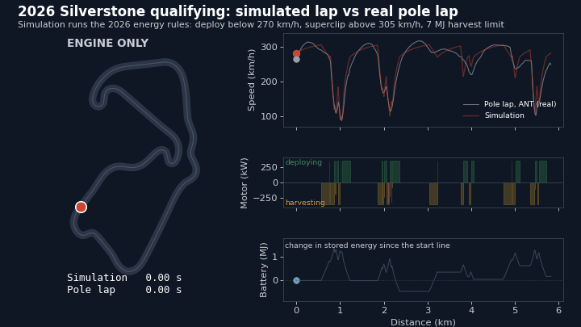
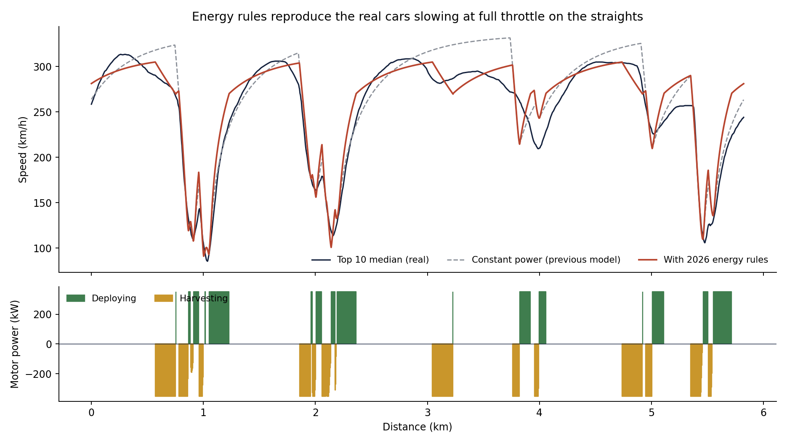
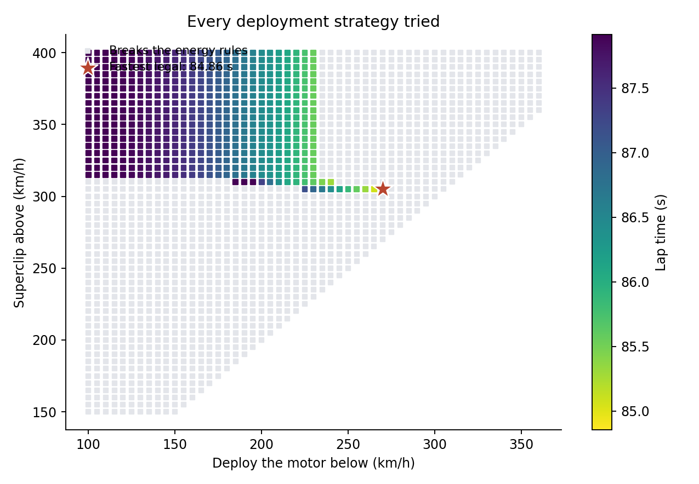
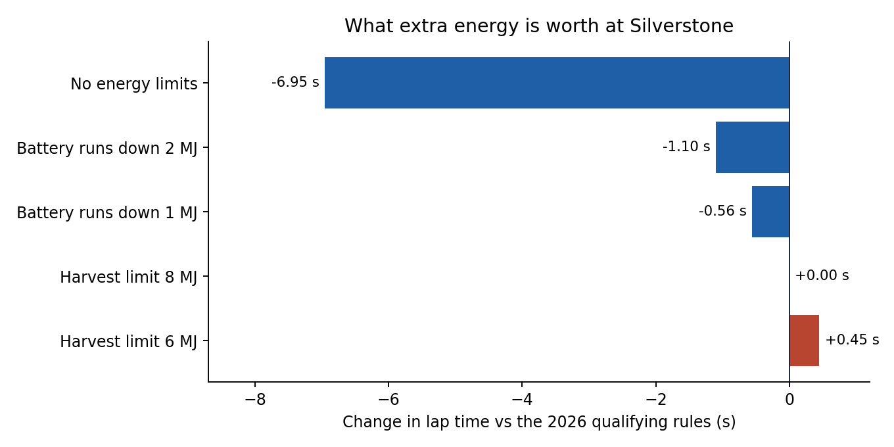

# 2026 F1 Lap Time Simulator: Silverstone

A quasi-steady-state lap time simulator built from scratch in Python, with
the car's parameters calibrated from real 2026 British Grand Prix qualifying
telemetry for all 22 drivers. The most useful result isn't the lap time
itself: it's what the calibration revealed about the 2026 cars, and why a
model that matches the real lap time can still be wrong.

Part 2 adds the 2026 power unit (battery deployment, harvesting and
superclipping under the qualifying energy rules) and finds the fastest legal
way to spend the energy.



*The energy-optimised simulation (red) racing a ghost of the real pole lap
(white), with speed, motor power and battery level. A full-quality version
is in `charts/lap_animation.mp4`.*


## How it works

**Track.** Real track geometry has to be built from telemetry, and a single
driver's recorded line is too noisy: curvature comes from a second
derivative, which amplifies small position errors. Running the same car on
each driver's own line gave lap times spread over 3.5 seconds, far more
than genuine line differences could explain. So the track is a consensus
line: all 22 drivers' lines averaged point by point, which cancels much of
the independent noise in each, then fitted with a periodic smoothing spline.
(FastF1 position data is in decimetres, confirmed by checking the path
length against the telemetry's own distance channel.)

**Solver.** At every point around the lap, the car's speed is the lowest of:
the cornering limit (as fast as grip allows through the corner), a forward
pass (accelerating as hard as possible from behind), and a backward pass
(braking as hard as possible for what's ahead). Tyres share one grip budget
between cornering and braking or accelerating (the friction circle), so a
car still turning can only use part of its grip to accelerate.

**Car.** Mass is the FIA's 2026 minimum (768 kg). Everything else is fitted
to the telemetry:

| Parameter | Value | How it was fitted |
|---|---|---|
| Cornering grip | 1.71 | Straight-line fit across 7 grip-limited corners |
| Downforce area (ClA) | 6.5 m² | Same fit |
| Effective power | 455 kW (610 hp) | Full-throttle acceleration on the straights |
| Drag area (CdA) | 0.92 m² | Same fit |
| Braking limit | 3.0 g (+ drag) | Peak braking of the top 10, median |

These are effective values: each one absorbs things the model doesn't
represent separately, so they describe how the car behaves rather than its
true aerodynamic coefficients.

## Calibrating the corners

At a car's grip limit, the sideways acceleration it can hold rises in a
straight line with speed squared, because downforce grows with speed
squared. The intercept gives the tyre grip, the slope gives the downforce.


One corner was excluded, for a reason decided from the throttle data before
fitting, not because it spoiled the fit: the top 10 took it flat out
(median 100% throttle). A corner taken flat out isn't at the grip limit, so
it only shows the car can do *at least* that speed. Every other corner had
drivers modulating the throttle, the sign of being at the limit.

Fit: R² = 0.94. Leaving each corner out in turn and predicting it from the
rest gives an 11% average error, a fairer test with only seven points.

## What the data shows about the 2026 cars


**Effective power is about 455 kW, well below the 750 kW headline.** Under
the 2026 rules roughly half the power is electric, and the electric motor
is limited by how much battery energy is available per lap, so the car
can't run at full power all lap.

The speed trace shows this directly. On two of Silverstone's straights, with
the throttle at 100% the whole way, the real cars **lose 43 km/h and 22
km/h** before reaching the braking zone. That's the battery running out.


## Results

| | Lap time |
|---|---|
| Simulation | 84.87 s |
| Bootstrap 95% interval | 84.8 to 86.8 s |
| Real pole (Antonelli) | 88.11 s |

The simulation is 3.7% faster than pole. A point-mass simulator describes a
driver who uses every bit of grip perfectly, with no weight transfer, tyre
temperature effects or time spent changing direction, so it should come out
quicker than reality. Part 2 below shows where the gap actually sits: mostly
in the corners, not on the straights as first assumed.

The bootstrap interval comes from rebuilding the consensus line 30 times
from random samples of drivers, showing how much the answer depends on
which drivers' lines go into the track geometry.


## A matching lap time is not validation


The first version of the model used published figures for power and
downforce. It came out at 88.7 s, within 0.6 s of pole, and it would have
been easy to stop there. But checking corner speeds showed it was **29
km/h too slow at the apexes on average** (152 km/h against a real 226 at
one fast corner). It only matched the lap time because it also accelerated
too hard (full headline power everywhere) and braked too hard (no braking
limit), so its errors cancelled out.

The calibrated model halves the apex error to 15 km/h, and is quicker than
reality for reasons that can be identified. It's the better model, despite
the worse-looking lap time.

## What each parameter is worth


A 10% change in each parameter, one at a time. Tyre grip matters most (about
3 s), then mass, power and downforce. As an independent check, the mass
result works out at roughly 0.33 s per 10 kg, in line with the commonly
quoted F1 rule of thumb of around 0.3 s per 10 kg per lap.

## Part 2: 2026 energy deployment

The model above gives the car a constant average power. Real 2026 cars
don't work like that, so Part 2 adds the power unit as the rules define it
(as amended before the Miami GP, so in force at Silverstone):

- A petrol engine of about 400 kW, plus an electric motor of up to 350 kW
- The motor can push the car (deploying battery energy) or charge the
  battery. That includes **superclipping**: recharging at full throttle, so
  the car slows down with the pedal flat
- Energy is also harvested under braking, at up to 350 kW
- In qualifying, harvesting is capped at **7 MJ per lap**, and the battery
  can't deploy more than it has harvested

The strategy is set by two speeds: deploy the motor below one, superclip
above the other. Superclipping carries on until the next corner, as the
telemetry shows real cars doing. The simulation searches 1,800 strategies
for the fastest legal lap (core loops compiled with Numba: about 4 seconds
per search). Drag was refitted for this model, to 1.0 m², by matching real
straight-line speeds: the earlier 0.92 had been absorbing the missing
energy limits.



**Best strategy: deploy below 270 km/h, superclip above 305 km/h.** That
harvests 4.2 MJ under braking and 2.4 MJ from clipping, and deploys 6.4 MJ.
Deploying at low speed makes sense because a joule spent there buys more
time: the car spends longer covering each metre.

The model now reproduces the real behaviour on the straights. On the first
straight it goes from 305 to 271 km/h at full throttle, against a real 313
to 269, and the straight-line speed error drops from 22 to 17 km/h.



### What energy is worth



- **The energy rules cost about 7 seconds a lap.** With unlimited
  deployment the lap would be 77.9 s, against 84.9 s under the rules
- **Battery energy is worth about 0.55 s per MJ**: letting the battery run
  down 1 MJ over the lap saves 0.56 s, and 2 MJ saves 1.10 s
- **A tighter 6 MJ harvest limit costs 0.45 s, but raising it to 8 MJ gains
  nothing.** The best strategy only harvests 6.6 MJ: clipping harder for more
  energy costs more time on the straights than the extra energy wins back

### What this changed about the lap time

Almost nothing: 84.86 s against 84.87 s with constant power. The constant
455 kW had captured the energy limit on average, so it got the time spent
on the straights roughly right while getting their shape wrong.

That corrected an assumption. I'd expected the energy limits to explain most
of the 3.7% gap to pole. Breaking the remaining gap down by what the real
drivers were doing at each point:

| Real driver was | Share of lap | Time the model gains |
|---|---|---|
| At full throttle | 75% | 1.87 s |
| On part throttle or coasting | 16% | 1.81 s |
| Braking | 8% | 0.12 s |

The part-throttle phases, mostly corner entry and mid-corner, are only 16%
of the lap but account for half the gap. Real drivers spend time there
balancing the car, and a point-mass model goes straight from braking to
cornering to accelerating, with no weight transfer. Much of the full-throttle
gap also starts in the corners, since the model exits them faster and
carries that speed down the straight.

## Limitations

- **Point mass.** No weight transfer, suspension, or tyre load sensitivity
- **Fixed racing line.** The simulation drives the consensus line rather
  than finding the fastest line
- **Effective parameters.** Fitted to one session, so they may not carry
  over to another track or conditions
- **Telemetry resolution.** Speed is sampled a few times a second, which
  rounds off the sharpest braking peaks

## Next step

The corners. A model with weight transfer between the axles, or at least a
limit on how quickly the car can move from braking to cornering to
accelerating, would target the largest remaining error. Energy modelling
could also go further: a strategy that varies deployment corner by corner,
rather than by two speeds, and the 250 kW deployment limit outside the
main acceleration zones.

## Project structure

```
scripts/fetch_track.py   downloads telemetry for every driver (run locally)
tracksim/
  track.py               consensus line, spline fit, curvature
  vehicle.py             point-mass car model
  solver.py              speed profile solver with combined grip
  calibrate.py           fits every vehicle parameter to telemetry
  energy.py              2026 power unit, deployment and harvesting, strategy search
analysis/
  run_analysis.py        Part 1
  energy_analysis.py     Part 2 (about a minute)
  make_animation.py      animated lap, MP4 and GIF (about two minutes)
charts/                  output charts
data/                    Silverstone 2026 qualifying telemetry
results.json             headline numbers
```

## Running it

```bash
pip install -r requirements.txt
python analysis/run_analysis.py
python analysis/energy_analysis.py
python analysis/make_animation.py
```

The animation needs `ffmpeg` installed for the MP4; the GIF works without it.

The telemetry is included, so this runs without fetching anything. To use
another session, edit `SESSIONS_TO_FETCH` in `scripts/fetch_track.py`, run
it (needs `fastf1`), and point the analysis at the new data.

## Tech stack

Python, NumPy, SciPy, pandas, Matplotlib, Numba, FastF1 (data collection only)
