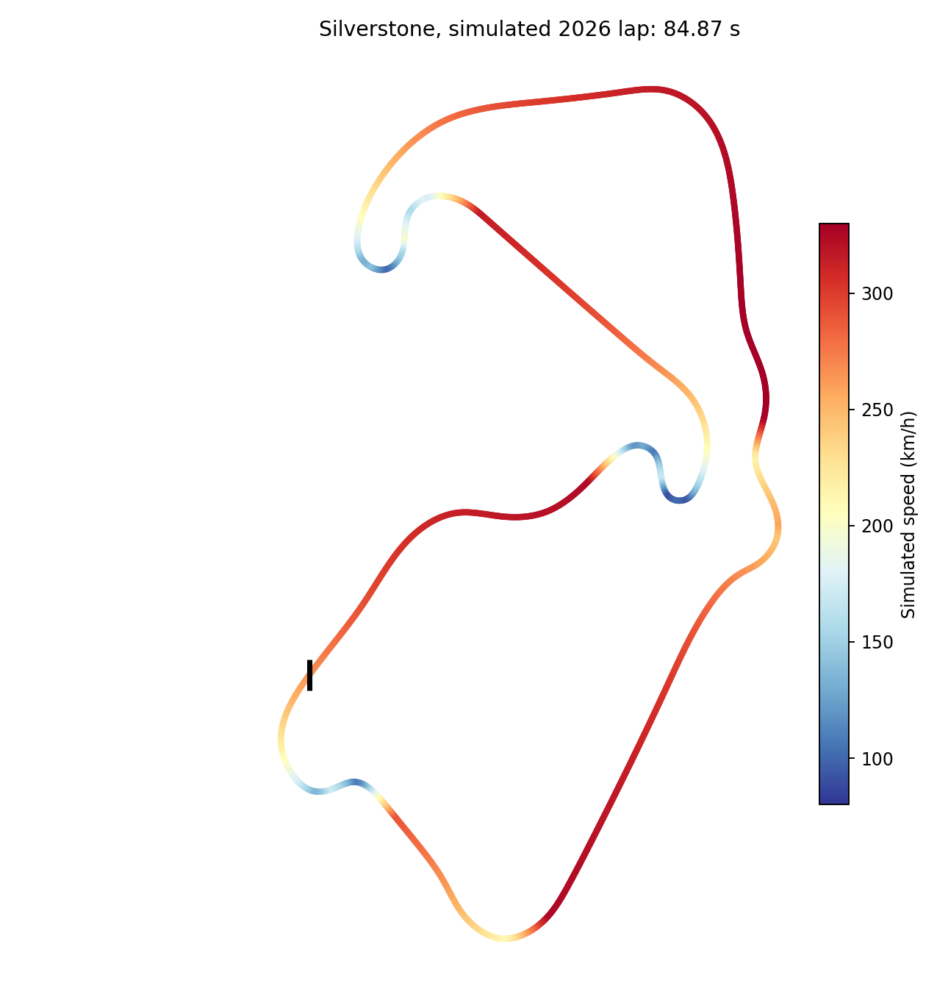
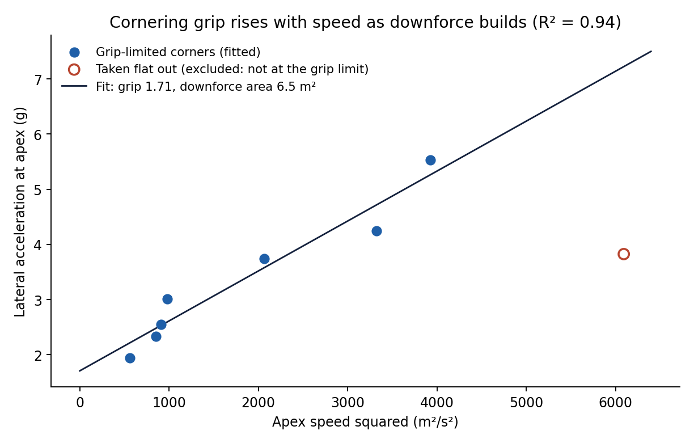
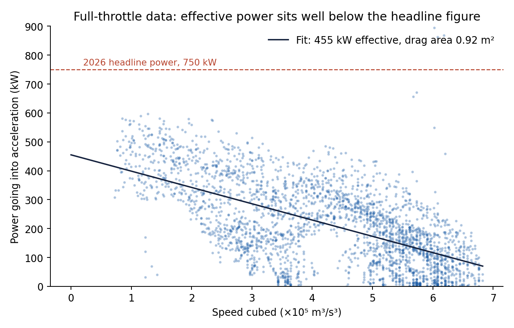
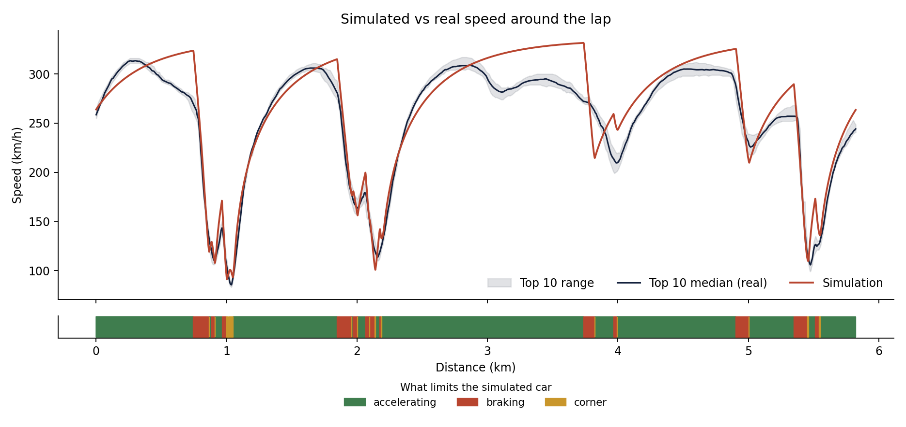
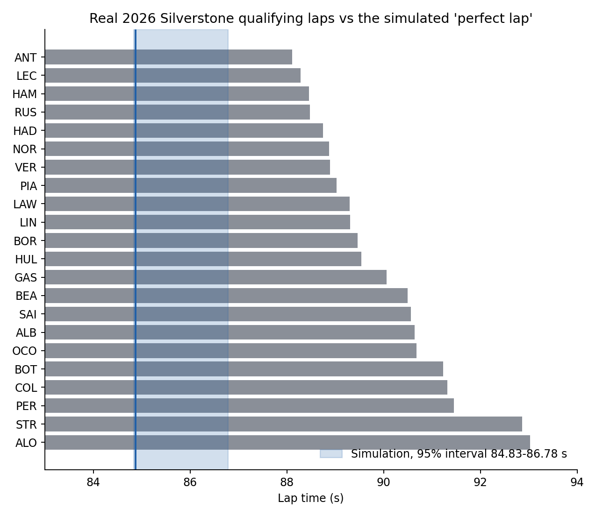
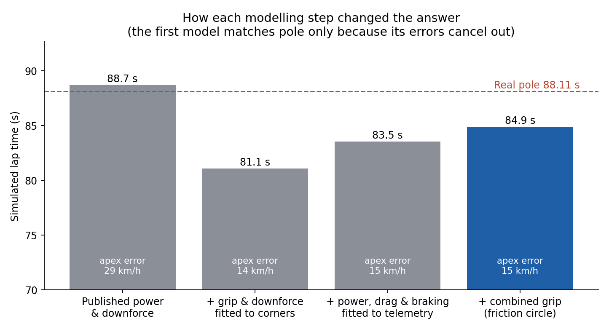
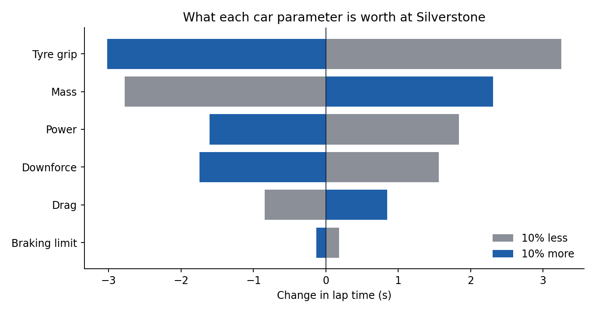

# 2026 F1 Lap Time Simulator: Silverstone

A quasi-steady-state lap time simulator built from scratch in Python, with
the car's parameters calibrated from real 2026 British Grand Prix qualifying
telemetry for all 22 drivers. The most useful result isn't the lap time
itself: it's what the calibration revealed about the 2026 cars, and why a
model that matches the real lap time can still be wrong.



## How it works

**Track.** Real track geometry has to be built from telemetry, and a single
driver's recorded line is too noisy: curvature comes from a second
derivative, which amplifies small position errors. Running the same car on
each driver's own line gave lap times spread over 3.5 seconds, far more
than genuine line differences could explain. So the track is a consensus
line: all 22 drivers' lines averaged point by point, which cancels much of
the independent noise in each, then fitted with a periodic smoothing spline.
(FastF1 position data is in decimetres, confirmed by checking the path
length against the telemetry's own distance channel.)

**Solver.** At every point around the lap, the car's speed is the lowest of:
the cornering limit (as fast as grip allows through the corner), a forward
pass (accelerating as hard as possible from behind), and a backward pass
(braking as hard as possible for what's ahead). Tyres share one grip budget
between cornering and braking or accelerating (the friction circle), so a
car still turning can only use part of its grip to accelerate.

**Car.** Mass is the FIA's 2026 minimum (768 kg). Everything else is fitted
to the telemetry:

| Parameter | Value | How it was fitted |
|---|---|---|
| Cornering grip | 1.71 | Straight-line fit across 7 grip-limited corners |
| Downforce area (ClA) | 6.5 m² | Same fit |
| Effective power | 455 kW (610 hp) | Full-throttle acceleration on the straights |
| Drag area (CdA) | 0.92 m² | Same fit |
| Braking limit | 3.0 g (+ drag) | Peak braking of the top 10, median |

These are effective values: each one absorbs things the model doesn't
represent separately, so they describe how the car behaves rather than its
true aerodynamic coefficients.

## Calibrating the corners

At a car's grip limit, the sideways acceleration it can hold rises in a
straight line with speed squared, because downforce grows with speed
squared. The intercept gives the tyre grip, the slope gives the downforce.



One corner was excluded, for a reason decided from the throttle data before
fitting, not because it spoiled the fit: the top 10 took it flat out
(median 100% throttle). A corner taken flat out isn't at the grip limit, so
it only shows the car can do *at least* that speed. Every other corner had
drivers modulating the throttle, the sign of being at the limit.

Fit: R² = 0.94. Leaving each corner out in turn and predicting it from the
rest gives an 11% average error, a fairer test with only seven points.

## What the data shows about the 2026 cars



**Effective power is about 455 kW, well below the 750 kW headline.** Under
the 2026 rules roughly half the power is electric, and the electric motor
is limited by how much battery energy is available per lap, so the car
can't run at full power all lap.

The speed trace shows this directly. On two of Silverstone's straights, with
the throttle at 100% the whole way, the real cars **lose 43 km/h and 22
km/h** before reaching the braking zone. That's the battery running out.



## Results

| | Lap time |
|---|---|
| Simulation | 84.87 s |
| Bootstrap 95% interval | 84.8 to 86.8 s |
| Real pole (Antonelli) | 88.11 s |

The simulation is 3.7% faster than pole. A point-mass simulator describes a
driver who uses every bit of grip perfectly, with no weight transfer, tyre
temperature effects or time spent changing direction, so it should come out
quicker than reality. The biggest single gap is on the straights, where the
model gives the car constant power but the real cars run out of battery
energy.

The bootstrap interval comes from rebuilding the consensus line 30 times
from random samples of drivers, showing how much the answer depends on
which drivers' lines go into the track geometry.



## A matching lap time is not validation



The first version of the model used published figures for power and
downforce. It came out at 88.7 s, within 0.6 s of pole, and it would have
been easy to stop there. But checking corner speeds showed it was **29
km/h too slow at the apexes on average** (152 km/h against a real 226 at
one fast corner). It only matched the lap time because it also accelerated
too hard (full headline power everywhere) and braked too hard (no braking
limit), so its errors cancelled out.

The calibrated model halves the apex error to 15 km/h, and is quicker than
reality for reasons that can be identified. It's the better model, despite
the worse-looking lap time.

## What each parameter is worth



A 10% change in each parameter, one at a time. Tyre grip matters most (about
3 s), then mass, power and downforce. As an independent check, the mass
result works out at roughly 0.33 s per 10 kg, in line with the commonly
quoted F1 rule of thumb of around 0.3 s per 10 kg per lap.

## Limitations

- **Constant power.** The biggest gap. Real 2026 cars harvest and deploy
  battery energy unevenly around the lap and slow down on straights when it
  runs out
- **Point mass.** No weight transfer, suspension, or tyre load sensitivity
- **Fixed racing line.** The simulation drives the consensus line rather
  than finding the fastest line
- **Effective parameters.** Fitted to one session, so they may not carry
  over to another track or conditions
- **Telemetry resolution.** Speed is sampled a few times a second, which
  rounds off the sharpest braking peaks

## Next step

Energy deployment: tracking the battery's charge around the lap, with
harvesting under braking and deployment limits, would address the largest
remaining error and model the defining feature of the 2026 regulations.

## Project structure

```
scripts/fetch_track.py   downloads telemetry for every driver (run locally)
tracksim/
  track.py               consensus line, spline fit, curvature
  vehicle.py             point-mass car model
  solver.py              speed profile solver with combined grip
  calibrate.py           fits every vehicle parameter to telemetry
analysis/run_analysis.py produces every chart and number in this write-up
charts/                  output charts
data/                    Silverstone 2026 qualifying telemetry
results.json             headline numbers
```

## Running it

```bash
pip install -r requirements.txt
python analysis/run_analysis.py
```

The telemetry is included, so this runs without fetching anything. To use
another session, edit `SESSIONS_TO_FETCH` in `scripts/fetch_track.py`, run
it (needs `fastf1`), and point the analysis at the new data.

## Tech stack

Python, NumPy, SciPy, pandas, Matplotlib, FastF1 (data collection only)
